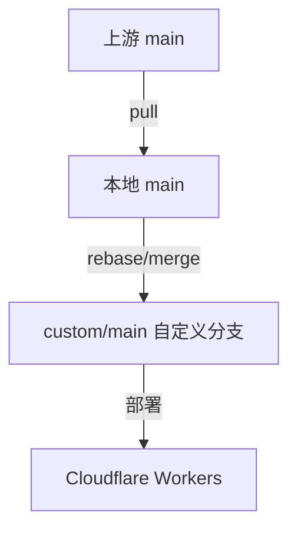

# 避免同步上游代码覆盖自定义修改的方案

## 当前状态
- 你当前在分支 `trae/solo-agent-KiJh6h` 上
- 已修改了 `wrangler.toml` 和 `index.js`（使用混淆版本）

---

## 方案一：创建独立分支管理自定义修改（推荐）

### 步骤：

1. **创建自定义分支**
```bash
git checkout -b custom/main
```

2. **提交你的自定义修改**
```bash
git add wrangler.toml index.js
git commit -m "feat: add custom deployment configuration"
```

3. **拉取上游更新时**
```bash
# 切换回主分支
git checkout main

# 拉取上游更新
git pull origin main

# 切换回自定义分支
git checkout custom/main

# 合并更新（使用 rebase 或 merge）
git rebase main
# 或者
git merge main
```

---

## 方案二：使用 git stash 暂存修改

### 步骤：

1. **暂存你的修改**
```bash
git stash push -m "my custom changes"
```

2. **拉取上游更新**
```bash
git checkout main
git pull origin main
```

3. **恢复你的修改**
```bash
git checkout trae/solo-agent-KiJh6h  # 或者你的自定义分支
git stash pop
```

4. **解决冲突（如果有）**

---

## 方案三：使用 .gitignore 保护配置文件

如果你的配置包含敏感信息（如 UUID、自定义域名等），可以：

1. **创建配置模板**
```bash
cp wrangler.toml wrangler.toml.example
```

2. **修改 .gitignore**
```bash
echo "wrangler.toml" >> .gitignore
echo ".env" >> .gitignore
```

3. **维护本地配置文件**，只提交模板文件

---

## 方案四：使用工作树分离

```bash
# 创建部署分支
git checkout -b deploy

# 在 deploy 分支上应用自定义修改
# ...

# 上游更新时
git checkout main
git pull
git checkout deploy
git rebase main
```

---

## 推荐工作流



### 日常使用：

```bash
# 1. 在 custom/main 分支工作
git checkout custom/main

# 2. 提交你的修改
git add .
git commit -m "your commit message"

# 3. 需要同步上游时
git checkout main
git pull origin main
git checkout custom/main
git rebase main  # 或者 git merge main

# 4. 解决冲突后继续
```

---

## 注意事项

1. **不要直接修改 main 分支** - main 分支只用于跟踪上游
2. **定期同步上游** - 避免差异过大导致冲突过多
3. **使用有意义的提交信息** - 方便后续查看和回滚
4. **备份重要配置** - 使用 git 分支或外部备份
